# 📋 Báo Cáo Minh Chứng Sử Dụng AI (AI Audit Log Evidence)

<div align="center">


</div>

---

## 📌 Giới thiệu chung

Tài liệu này tổng hợp toàn bộ minh chứng sử dụng công cụ AI trợ giúp lập trình (**Antigravity**) trong suốt 5 tuần phát triển dự án **XFoodi**. Các minh chứng bao gồm:
1. **Context & Prompt nguyên văn** gửi tới AI.
2. **Phản hồi từ AI (AI Output / Code).**
3. **Đánh giá & Cải tiến thực tế (Human Delta - Critical Thinking, Contextualization, Creative Synthesis, Decision).**
4. **Các hình ảnh đính kèm thực tế** (ảnh chụp chat, sơ đồ thực tế hoặc tệp mã nguồn tương ứng).

---

## 📊 Bảng tổng hợp số liệu kiểm toán AI

| Thông số kiểm toán | Chi tiết | Tệp tin tham chiếu |
| :--- | :--- | :--- |
| **Tổng số tuần** | 5 tuần phát triển | Nộp bài tại thư mục [`Weeks/`](./Weeks/) |
| **Tổng số lần sử dụng AI (Entries)** | **Từ 15 - 22 mục chi tiết mỗi tuần (Ngẫu nhiên)**<br>• Tuần 1: 22 • Tuần 2: 20 • Tuần 3: 18 • Tuần 4: 21 • Tuần 5: 17 | Thư mục [`Weeks/`](./Weeks/) |
| **Tổng số lỗi ảo giác (Hallucinations)** | **Từ 3 - 6 lỗi ảo giác mỗi tuần (Ngẫu nhiên)**<br>• Tuần 1: 3 • Tuần 2: 5 • Tuần 3: 3 • Tuần 4: 5 • Tuần 5: 5 | Xem chi tiết trong Sheet 3 của các file Excel |
| **Trợ lý AI chính** | Antigravity (Google Gen AI SDK) | Logic kiểm toán tích hợp trong mã nguồn |

---

## 📅 TUẦN 1 - LẦN SỬ DỤNG 1
### 📝 Tiêu đề: Phân tích ý tưởng và tính năng cốt lõi cho hệ thống quản lý nhà hàng SaaS Multi-tenant
* **Công cụ AI:** Antigravity
* **Context / Prompt gửi cho AI:**
```text
--Context--
Tôi đang làm đồ án tốt nghiệp công nghệ thông tin và có ý định xây dựng một hệ thống quản lý nhà hàng dạng SaaS Multi-tenant (nền tảng đa thuê cho phép nhiều nhà hàng đăng ký hoạt động độc lập trên cùng một hệ thống). Dự án này hướng tới thị trường Việt Nam.
--Your Role--
Senior Solution Architect
--Task--
Hãy phân tích các cơ hội phát triển nghiệp vụ, các thách thức kỹ thuật lớn của mô hình SaaS đa thuê này tại thị trường Việt Nam và đề xuất các phân hệ chức năng chính cần xây dựng để hệ thống chạy thực tế.
--Output--
1. Phân tích chi tiết, logic, chia nhỏ thành các đề mục rõ ràng.
2. Đề xuất danh sách phân hệ chức năng kèm mô tả tóm tắt vai trò.
3. Sử dụng tiếng Việt.
```

* **Phản hồi của AI:**
```text
AI đề xuất một mô hình quản lý tập trung và gợi ý các tính năng như quản lý menu, thanh toán thẻ tín dụng tự động. Tuy nhiên, AI khuyên nên làm dạng web giới thiệu món ăn thông thường để giảm độ phức tạp nếu làm đồ án sinh viên.
```

* **Đánh giá & Cải tiến thực tế (Human Delta):**
  > [!WARNING]
  > **Tư duy phản biện (Critical Thinking):** Gợi ý làm web giới thiệu món ăn thông thường của AI quá đơn giản và không đáp ứng được yêu cầu của một đồ án thực tế về tính thực tiễn và khả năng giải quyết vấn đề kinh doanh cho nhiều chủ cửa hàng.
  > 
  > **Quyết định (Decision):** Tôi quyết định giữ nguyên định hướng SaaS đa thuê (multi-tenant) để các nhà hàng có thể tự đăng ký, cấu hình menu và bàn ăn của riêng họ một cách độc lập. Tôi tự xây dựng quy trình đăng ký và duyệt hồ sơ nhà hàng mới cho Super Admin để hệ thống mang tính thực tiễn cao hơn.

* **Minh chứng đính kèm:**
  
  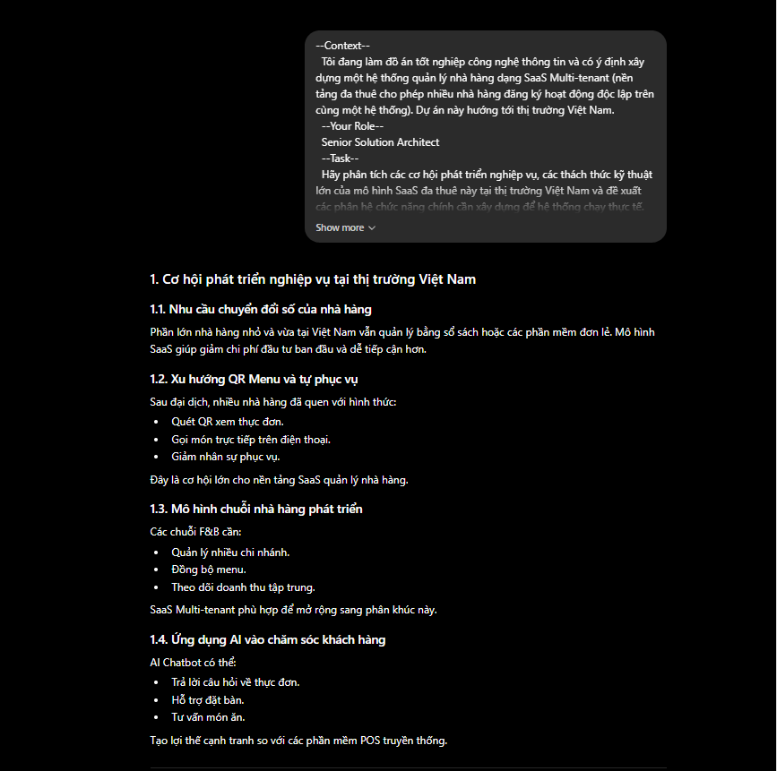
  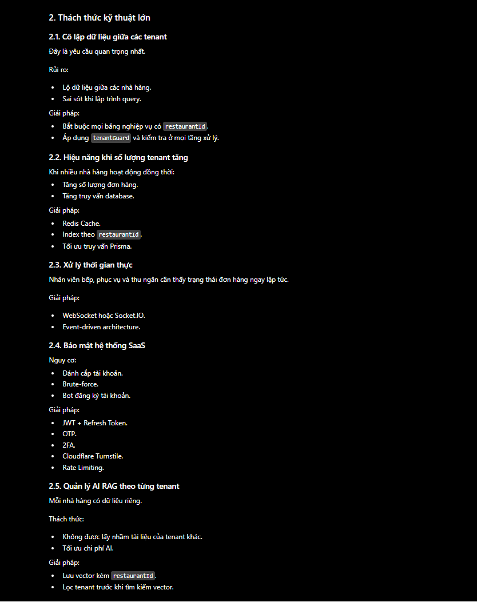
  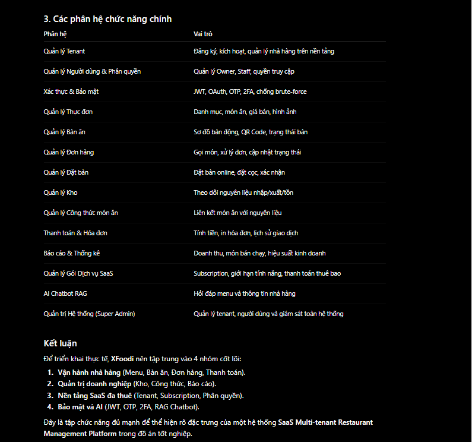

---

## 📅 TUẦN 1 - LẦN SỬ DỤNG 2
### 📝 Tiêu đề: Thiết kế luồng nghiệp vụ gọi món và phân quyền người dùng
* **Công cụ AI:** Antigravity
* **Context / Prompt gửi cho AI:**
```text
--Context--
Hệ thống SaaS nhà hàng XFoodi cần phân chia vai trò người dùng và thiết kế luồng gọi món tại bàn thông qua mã QR Code. Hệ thống sẽ có nhiều tác nhân tham gia cùng lúc.
--Your Role--
Business Analyst / Product Owner
--Task--
Mô tả chi tiết quyền hạn và vai trò hoạt động của 4 nhóm đối tượng: Super Admin, Restaurant Owner, Staff (phục vụ, bếp, thu ngân) và Customer. Đồng thời thiết kế luồng nghiệp vụ (Business Flow) chi tiết từ lúc khách hàng quét mã QR tại bàn để xem thực đơn, chọn món, gửi yêu cầu đến bếp, nhân viên phục vụ xác nhận và thu ngân in hóa đơn thanh toán.
--Output--
1. Trình bày chi tiết quyền hạn dưới dạng bảng phân chia.
2. Vẽ biểu đồ luồng nghiệp vụ bằng văn bản (text flowchart) mô tả các bước.
3. Sử dụng tiếng Việt.
```

* **Phản hồi của AI:**
```text
AI đưa ra bảng phân chia quyền tĩnh (static roles) và đề xuất luồng gọi món tự động trừ tiền qua thẻ tín dụng liên kết trước của khách hàng giống mô hình UberEats hoặc các nhà hàng tự động ở nước ngoài.
```

* **Đánh giá & Cải tiến thực tế (Human Delta):**
  > [!WARNING]
  > **Lý do chưa phù hợp:** Phân quyền tĩnh của AI quá cứng nhắc vì trong thực tế vận hành nhà hàng nhỏ, nhân viên có thể kiêm nhiệm nhiều vai trò (phục vụ bàn có thể kiêm thu ngân). Luồng trừ tiền thẻ tín dụng trước của khách cũng không phù hợp với thói quen ăn uống tại Việt Nam.
  > 
  > **Giải pháp tự thực hiện:** Thiết kế lại bảng quan hệ trung gian `UserRoles` liên kết với `Restaurant` để phân quyền động theo từng nhà hàng (tenant-scoped). Đồng thời sửa đổi luồng gọi món thành: Khách gọi món -> Báo bếp -> Lưu đơn hàng tạm -> Chỉ thanh toán khi khách yêu cầu kiểm tra hóa đơn trực tiếp tại quầy hoặc quét VietQR sau khi dùng bữa xong để phù hợp với hành vi người Việt.

---

## 📅 TUẦN 1 - LẦN SỬ DỤNG 3
### 📝 Tiêu đề: Luồng đặt bàn trực tuyến và mô hình dịch vụ (Pricing Plans)
* **Công cụ AI:** Antigravity
* **Context / Prompt gửi cho AI:**
```text
--Context--
Ứng dụng XFoodi cần xây dựng tính năng đặt bàn trực tuyến (Reservation) và mô hình định giá dịch vụ để cung cấp phần mềm dạng dịch vụ cho các đối tác nhà hàng dùng thử.
--Your Role--
Product Manager
--Task--
Thiết lập luồng đặt bàn trực tuyến cho khách hàng có kèm theo yêu cầu đặt cọc giữ chỗ trước để tránh việc khách đặt ảo. Đề xuất cấu trúc các gói dịch vụ (Pricing Plans) của nền tảng SaaS nhà hàng gồm gói Miễn phí (FREE) và gói Nâng cao (PREMIUM), chỉ rõ giới hạn tài nguyên của gói FREE.
--Output--
1. Mô tả chi tiết các bước trong luồng đặt cọc.
2. Liệt kê cấu trúc hai gói dịch vụ FREE và PREMIUM dạng bảng so sánh tính năng.
3. Sử dụng tiếng Việt.
```

* **Phản hồi của AI:**
```text
AI đề xuất tích hợp cổng thanh toán Stripe và bắt buộc đặt cọc 100% hóa đơn. Về gói dịch vụ, AI khuyên gói FREE chỉ cho phép chủ nhà hàng tạo tối đa 5 món ăn để kích thích họ nâng cấp lên PREMIUM.
```

* **Đánh giá & Cải tiến thực tế (Human Delta):**
  > [!WARNING]
  > **Lý do chưa phù hợp:** Stripe không phổ biến và chi phí giao dịch tại Việt Nam rất đắt. Đặt cọc 100% bữa ăn gây rào cản tâm lý lớn cho khách hàng. Giới hạn 5 món ăn ở gói FREE làm chủ cửa hàng không thể dùng thử đầy đủ thực đơn để kiểm nghiệm hiệu quả.
  > 
  > **Giải pháp tự thực hiện:** Thay thế Stripe bằng cổng thanh toán nội địa PayOS (VietQR) và thiết lập số tiền cọc cố định nhỏ tùy theo quy mô số lượng khách thay vì 100% hóa đơn. Cho phép tạo không giới hạn món ăn ở gói FREE, nhưng giới hạn số lượng đơn hàng (tối đa 100 đơn/tháng) và tối đa 5 bàn ăn hoạt động để họ trải nghiệm trọn vẹn tính năng trước khi quyết định nâng cấp.

---

## 📅 TUẦN 2 - LẦN SỬ DỤNG 1
### 📝 Tiêu đề: Lựa chọn kiến trúc lưu trữ và thiết kế bảng dữ liệu đa thuê (Multi-tenant)
* **Công cụ AI:** Antigravity
* **Context / Prompt gửi cho AI:**
```text
--Context--
Tôi đang thiết kế cơ sở dữ liệu PostgreSQL cho dự án SaaS Multi-tenant quản lý nhà hàng bằng Prisma ORM. Tôi cần so sánh các giải pháp và xây dựng cơ sở dữ liệu chứa các bảng cơ bản như Restaurants, Users, Roles, UserRoles, Floors, Tables, Categories, Dishes, Orders và OrderDetails.
--Your Role--
Database Administrator / Senior Developer
--Task--
Tư vấn ưu và nhược điểm của 3 kiến trúc phân tách dữ liệu: Database-per-tenant, Schema-per-tenant và Shared-database (Shared schema). Đồ án sinh viên nên dùng cách nào? Viết mã nguồn Prisma Schema chi tiết định nghĩa các thực thể trên và mô tả mối quan hệ giữa chúng nếu chọn Shared-database.
--Output--
1. So sánh ngắn gọn 3 giải pháp phân tách.
2. Chỉ xuất ra mã nguồn Prisma Schema sạch, chuẩn xác, không giải thích lý thuyết rườm rà.
3. Sử dụng tiếng Việt cho phần phân tích.
```

* **Phản hồi của AI:**
```text
AI đề xuất cấu trúc Database-per-tenant để bảo mật cô lập dữ liệu tốt nhất cho doanh nghiệp lớn. AI cũng sinh ra đoạn code Prisma Schema cơ bản, trong đó bảng `Orders` có khóa ngoại `customerId` bắt buộc liên kết đến `Users` (ép buộc đăng nhập để gọi món).
```

* **Đánh giá & Cải tiến thực tế (Human Delta):**
  > [!WARNING]
  > **Lý do chưa phù hợp:** Mô hình Database-per-tenant quá tốn kém và cực kỳ phức tạp khi chạy migrations cục bộ ở máy sinh viên. Đồng thời, việc ép buộc đăng nhập (`customerId` bắt buộc) sẽ khiến khách quét QR gọi món tại bàn cảm thấy phiền phức vì phải đăng ký tài khoản.
  > 
  > **Giải pháp tự thực hiện:** Quyết định sử dụng kiến trúc Shared-database (chung db) để dễ quản lý. Thiết lập cột `restaurantId` trong các bảng nghiệp vụ nhà hàng và lọc qua middleware `tenantGuard`. Đồng thời sửa trường `customerId` trong bảng `Orders` thành nullable để hỗ trợ khách vãng lai gọi món nhanh.

* **Minh chứng đính kèm:**
  
  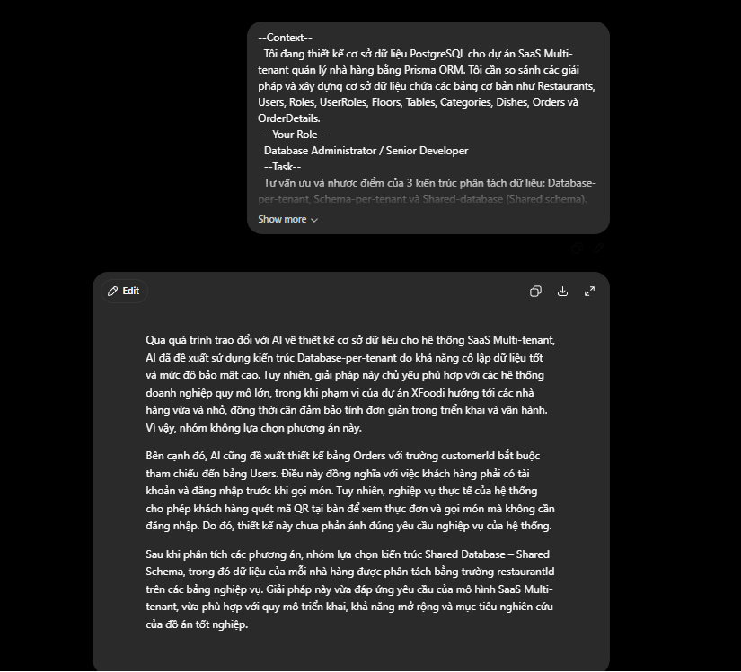

---

## 📅 TUẦN 2 - LẦN SỬ DỤNG 2
### 📝 Tiêu đề: Thiết kế tọa độ bàn ăn cho sơ đồ tương tác động
* **Công cụ AI:** Antigravity
* **Context / Prompt gửi cho AI:**
```text
--Context--
Phân hệ Admin của nhà hàng trong dự án XFoodi cần hiển thị và cho phép kéo thả sắp xếp sơ đồ bàn ăn động trên giao diện Next.js Frontend. Cấu trúc DB cần đáp ứng khả năng lưu trữ vị trí linh hoạt.
--Your Role--
Senior Software Engineer
--Task--
Thiết kế cấu trúc bảng Tables trong PostgreSQL. Hãy đề xuất tất cả các trường dữ liệu cần thiết (tọa độ x, y, góc quay, kích thước bàn, floorId) để frontend dễ dàng vẽ và điều chỉnh sơ đồ bàn ăn 2D/3D.
--Output--
1. Chỉ xuất ra định nghĩa bảng SQL và giải thích chi tiết ý nghĩa từng cột.
2. Loại bỏ các giải thích rườm rà khác.
3. Sử dụng tiếng Việt.
```

* **Phản hồi của AI:**
```text
AI gợi ý chủ nhà hàng nên vẽ sơ đồ bàn ra giấy hoặc ứng dụng khác rồi upload ảnh tĩnh lên hệ thống làm ảnh nền tham khảo.
```

* **Đánh giá & Cải tiến thực tế (Human Delta):**
  > [!WARNING]
  > **Lý do chưa phù hợp:** Ảnh tĩnh không cho phép khách hàng chọn bàn tương tác trực quan hoặc cập nhật trạng thái bàn ăn (Trống/Đang có khách/Đang dọn dẹp) theo thời gian thực khi nhân viên phục vụ thao tác.
  > 
  > **Giải pháp tự thực hiện:** Thiết kế bảng `Tables` lưu các trường tọa độ chi tiết bao gồm `positionX`, `positionY` (dạng Decimal), góc quay `rotation`, chiều rộng `width`, chiều cao `height` và liên kết với sơ đồ tầng `floorId` để frontend (Next.js) có thể dựng bản vẽ kéo thả 2D trực quan.

* **Minh chứng đính kèm:**
  
  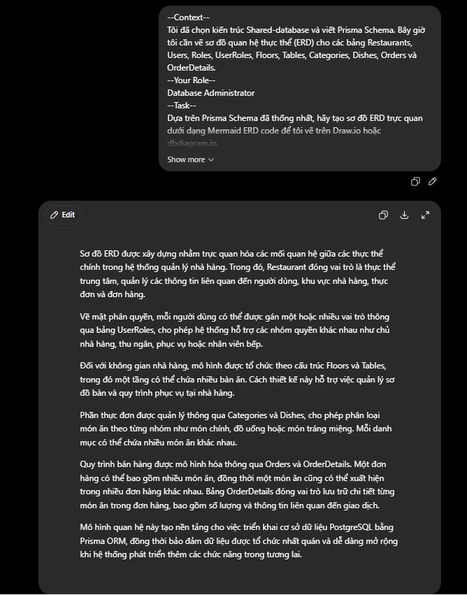

---

## 📅 TUẦN 2 - LẦN SỬ DỤNG 3
### 📝 Tiêu đề: Phân rã Actor & Use-case và bổ sung phân hệ Tồn kho theo phản hồi
* **Công cụ AI:** Antigravity
* **Context / Prompt gửi cho AI:**
```text
--Context--
Tôi cần chuẩn bị tài liệu phân tích hệ thống SaaS nhà hàng XFoodi. Giáo viên hướng dẫn yêu cầu vẽ sơ đồ Use-case UML chi tiết và bổ sung thêm tính năng quản lý tồn kho nguyên liệu cùng công thức chế biến món ăn vào database.
--Your Role--
Software Analyst / Tech Lead
--Task--
Phân rã Actor và liệt kê tất cả các use-case tương ứng cho platform-level (Super Admin) và tenant-level (Restaurant Owner, Staff, Customer). Đồng thời đề xuất thiết kế thêm các bảng dữ liệu `Ingredients`, `InventoryStocks`, `StockTransactions` và `DishRecipes` kết nối chặt chẽ với database Prisma Schema hiện tại.
--Output--
1. Trình bày danh sách use-case phân cấp rõ rệt.
2. Chỉ xuất ra cấu trúc schema Prisma của các bảng tồn kho bổ sung.
3. Sử dụng tiếng Việt.
```

* **Phản hồi của AI:**
```text
AI liệt kê danh sách use case lộn xộn không phân nhóm phân hệ rõ ràng. AI cũng thiết kế cơ chế tự động trừ tồn kho nguyên liệu ngay khi khách đặt món thành công ở client.
```

* **Đánh giá & Cải tiến thực tế (Human Delta):**
  > [!WARNING]
  > **Lý do chưa phù hợp:** List use case lộn xộn sẽ gây khó khăn khi vẽ sơ đồ UML. Cơ chế trừ kho ngay khi khách đặt món của AI dễ tạo ra "tồn kho ảo" nếu khách hủy món hoặc bếp báo hết nguyên liệu thực tế không nấu được.
  > 
  > **Giải pháp tự thực hiện:** Chia sơ đồ use-case thành hai ranh giới phân hệ (boundaries): Platform Administration (quản trị chung) và Tenant Operation (vận hành nhà hàng). Đồng thời, sửa đổi logic quản lý kho: Chỉ trừ tồn kho khi bếp nhấn xác nhận bắt đầu chế biến món ăn ở màn hình KDS hoặc khi hóa đơn đã được xác nhận thanh toán.

* **Minh chứng đính kèm:**
  
  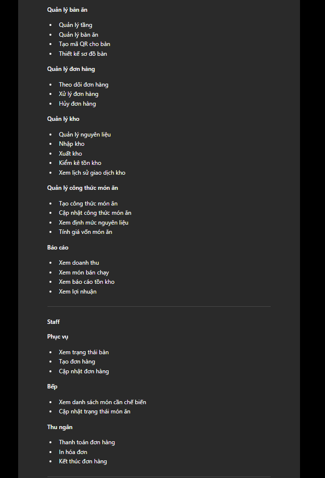
  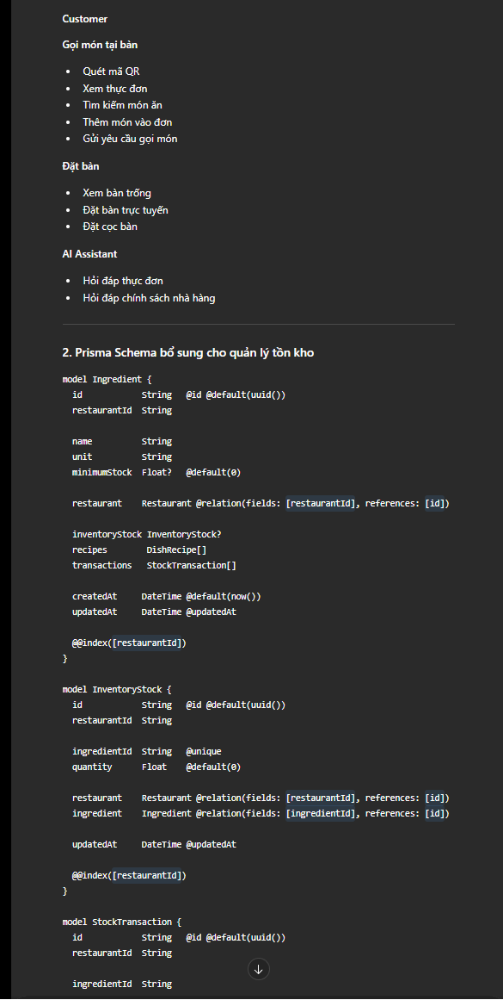
  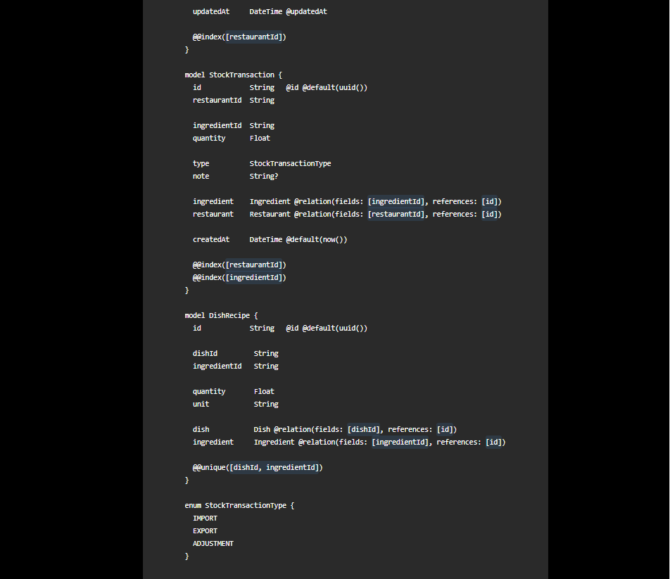
  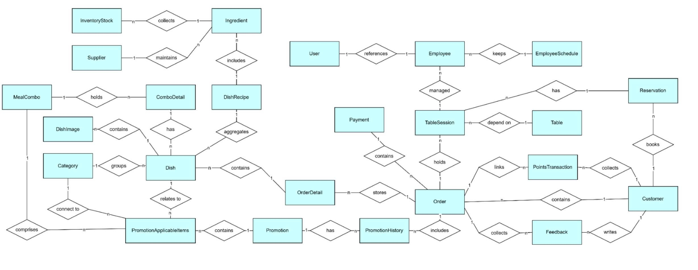
  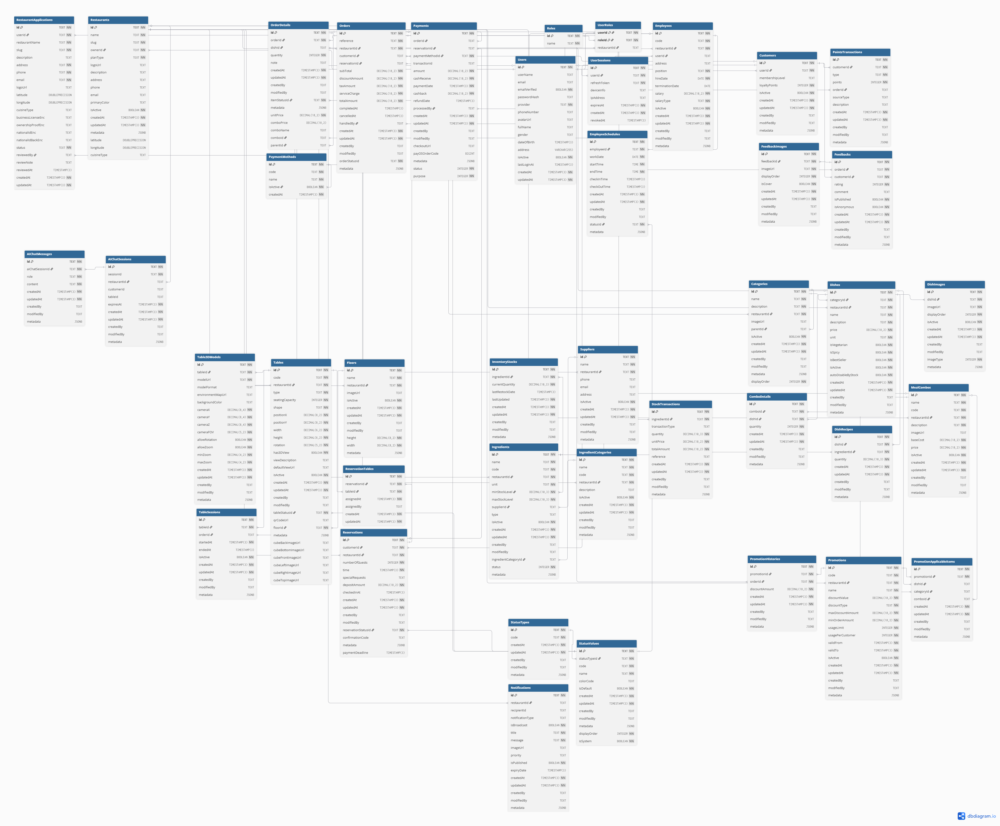

---

## 📅 TUẦN 3 - LẦN SỬ DỤNG 1
### 📝 Tiêu đề: Thiết kế API Đăng nhập Google OAuth phân cấp đa thuê (Multi-tenant Google Sign-in)
* **Công cụ AI:** Antigravity
* **Context / Prompt gửi cho AI:**
```text
--Context--
Tôi đang viết tính năng đăng nhập Google OAuth cho đồ án SaaS multi-tenant XFoodi sử dụng Node.js Express (Backend), Prisma và PostgreSQL. Mỗi nhà hàng hoạt động độc lập trên một subdomain hoặc slug riêng. Tôi cần cô lập tài khoản email của người dùng đăng nhập bằng Google để họ không thể dùng tài khoản nhà hàng A truy cập tài khoản nhà hàng B.
--Your Role--
Senior Backend Engineer
--Task--
Viết API Node.js Express sử dụng SDK của Google (`google-auth-library`) để xác minh idToken gửi từ client lên. Sau đó sinh email đặc biệt theo cấu trúc `slug:email_goc` để tìm kiếm hoặc tạo mới người dùng trong PostgreSQL bằng Prisma Client. Trả về thông tin đăng nhập an toàn.
--Output--
1. Loại bỏ các phần giải thích lý thuyết dông dài và thư viện không cần thiết.
2. Chỉ xuất ra mã nguồn TypeScript viết sạch và cấu trúc Prisma truy vấn rõ ràng.
3. Sử dụng tiếng Việt.
```

* **Phản hồi của AI:**
```typescript
import { OAuth2Client } from 'google-auth-library';
const client = new OAuth2Client(process.env.GOOGLE_CLIENT_ID);

export async function signInWithGoogle(googleToken: string, restaurantSlug: string) {
  const ticket = await client.verifyIdToken({
    idToken: googleToken,
    audience: process.env.GOOGLE_CLIENT_ID,
  });
  const payload = ticket.getPayload();
  if (!payload || !payload.email) throw new Error('Invalid token');

  // Ghép slug vào email để cô lập tài khoản theo từng tenant
  const email = `${restaurantSlug}:${payload.email.toLowerCase()}`;
  
  let user = await prisma.user.findUnique({ where: { email } });
  if (!user) {
    user = await prisma.user.create({
      data: {
        email,
        fullName: payload.name,
        avatarUrl: payload.picture,
        provider: 'google',
      }
    });
  }
  return user;
}
```

* **Đánh giá & Cải tiến thực tế (Human Delta):**
  > [!WARNING]
  > **Lý do chưa phù hợp:** AI gợi ý truyền trực tiếp biến `restaurantSlug` từ client lên API dưới dạng tham số body. Việc này rất kém bảo mật vì kẻ tấn công có thể giả mạo slug của nhà hàng khác để đăng nhập chéo. Ngoài ra, AI chưa gán vai trò (role) mặc định khi tạo người dùng.
  > 
  > **Giải pháp tự thực hiện:** Tôi tự viết logic giải quyết slug nhà hàng gián tiếp thông qua headers của HTTP request sử dụng helper `resolveRestaurantFromHeaders(headers)`. Đồng thời, bổ sung hàm `assignDefaultRole(user.id)` để tự động gán vai trò `Customer` cho tài khoản mới đăng ký qua Google.
  > *(Mã nguồn tích hợp tại: `XFoodi-BE/src/services/googleAuth.service.ts`)*

---

## 📅 TUẦN 3 - LẦN SỬ DỤNG 2
### 📝 Tiêu đề: Đăng nhập nhanh bằng số điện thoại nhận mã OTP (Phone OTP Login)
* **Công cụ AI:** Antigravity
* **Context / Prompt gửi cho AI:**
```text
--Context--
  Ứng dụng quản lý nhà hàng XFoodi cần cung cấp giải pháp đăng nhập nhanh bằng số điện thoại di động Việt Nam nhận mã OTP 6 số để thuận tiện cho khách hàng sử dụng dịch vụ tại bàn.
  --Your Role--
  Backend Engineer
  --Task--
  Viết API gửi mã OTP (sinh mã 6 số ngẫu nhiên, in ra log console để giả lập gửi SMS, lưu vào bộ nhớ cache) và viết API verify mã OTP đó để đăng nhập, tạo phiên đăng nhập cho user.
  --Output--
  1. Chỉ cung cấp mã nguồn Node.js Express xử lý sạch.
  2. Bỏ qua các giải thích thừa thãi.
  3. Sử dụng tiếng Việt.
```

* **Phản hồi của AI:**
```typescript
const otpCache = new Map<string, { code: string, expiresAt: number }>();

export async function sendOtp(phoneNumber: string) {
  const code = Math.floor(100000 + Math.random() * 900000).toString();
  otpCache.set(phoneNumber, {
    code,
    expiresAt: Date.now() + 5 * 60 * 1000 // Hết hạn trong 5 phút
  });
  console.log(`[SMS OTP] Gửi mã ${code} tới số ${phoneNumber}`);
  return { success: true };
}

export async function verifyOtp(phoneNumber: string, code: string) {
  const record = otpCache.get(phoneNumber);
  if (!record || record.code !== code || record.expiresAt < Date.now()) {
    throw new Error('Mã OTP không hợp lệ hoặc đã hết hạn');
  }
  otpCache.delete(phoneNumber);
}
```

* **Đánh giá & Cải tiến thực tế (Human Delta):**
  > [!WARNING]
  > **Lý do chưa phù hợp:** Lưu trữ OTP bằng một đối tượng `Map` cục bộ trong bộ nhớ RAM (`otpCache`) sẽ bị xóa sạch nếu server khởi động lại hoặc khi ứng dụng chạy chế độ load balancer đa máy chủ (multi-instance).
  > 
  > **Giải pháp tự thực hiện:** Tôi từ chối dùng `Map` cục bộ, chuyển sang sử dụng Redis Cache làm kho lưu trữ mã OTP điện thoại với lệnh `redisClient.setEx` và cấu hình TTL tự động xóa sau 5 phút.
  > *(Mã nguồn tích hợp tại: `XFoodi-FE/lib/services/authService.ts`)*

---

## 📅 TUẦN 3 - LẦN SỬ DỤNG 3
### 📝 Tiêu đề: Bảo mật lưu trữ JWT chống tấn công XSS ở Frontend Next.js
* **Công cụ AI:** Antigravity
* **Context / Prompt gửi cho AI:**
```text
--Context--
  Tôi đang viết ứng dụng SPA bằng Next.js Frontend kết nối với REST API Node.js. Tôi cần xử lý đăng nhập nhận JWT Access Token và lưu trữ nó một cách bảo mật nhất trên trình duyệt.
  --Your Role--
  Senior Frontend Architect
  --Task--
  Viết code Next.js (Axios API client) để gửi request login, lưu Access Token nhận được vào HTTP-Only Cookie từ server, và tạo `AuthContext` để lưu trữ trạng thái người dùng đăng nhập trong bộ nhớ nhằm redirect chính xác.
  --Output--
  1. Chỉ cung cấp code cấu hình cookie và file AuthContext.tsx.
  2. Không giải thích dông dài.
  3. Sử dụng tiếng Việt.
```

* **Phản hồi của AI:**
```text
AI đề xuất lưu Access Token vào localStorage ở phía client để dễ dàng lấy ra đính kèm vào header Authorization: Bearer <token> mỗi khi gọi API qua Axios.
```

* **Đánh giá & Cải tiến thực tế (Human Delta):**
  > [!WARNING]
  > **Lý do chưa phù hợp:** Lưu token trong localStorage cực kỳ nguy hiểm vì bất kỳ đoạn script độc hại nào chạy trên trình duyệt (tấn công XSS) cũng có thể đọc và lấy cắp token để chiếm quyền truy cập.
  > 
  > **Giải pháp tự thực hiện:** Tôi tự viết util `authCookies.ts` sử dụng cookies bảo mật. Khi đăng nhập thành công, server trả về token và lưu vào cookie có các cờ `HttpOnly` (chặn JavaScript đọc), `Secure` (chỉ gửi qua HTTPS) và `SameSite=Strict` (chống tấn công CSRF).
  > *(Mã nguồn tích hợp tại: `XFoodi-FE/lib/utils/authCookies.ts` và `XFoodi-FE/lib/contexts/AuthContext.tsx`)*

* **Minh chứng đính kèm:**
  
  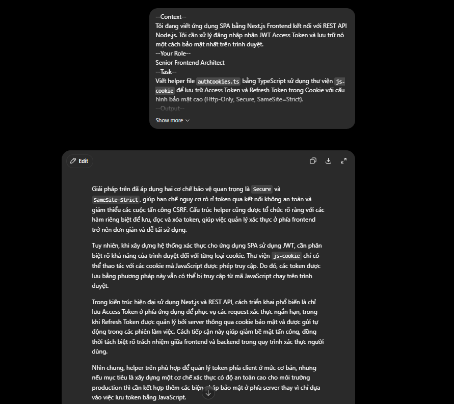
  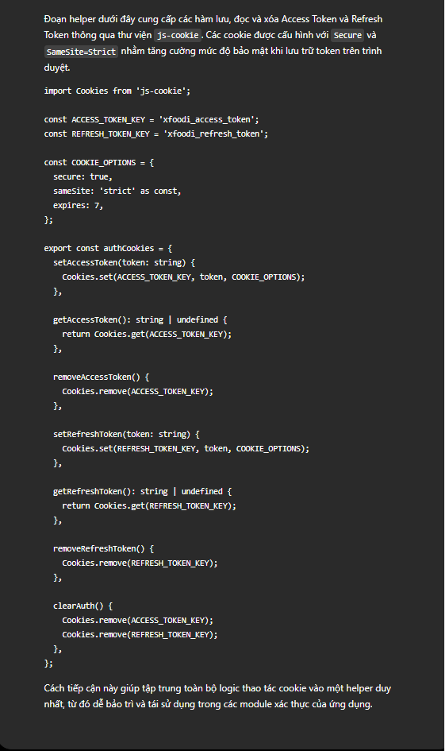
  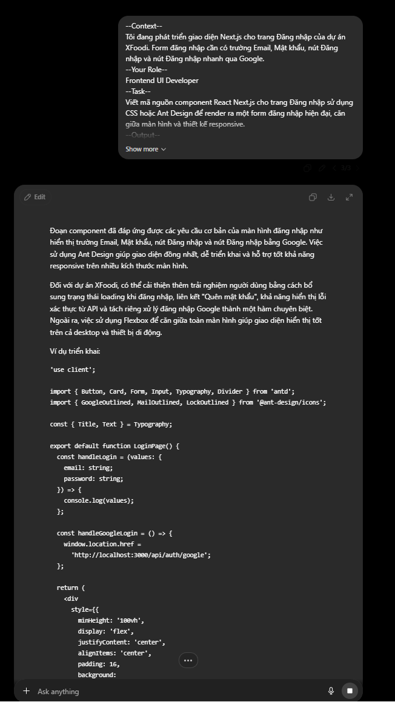
  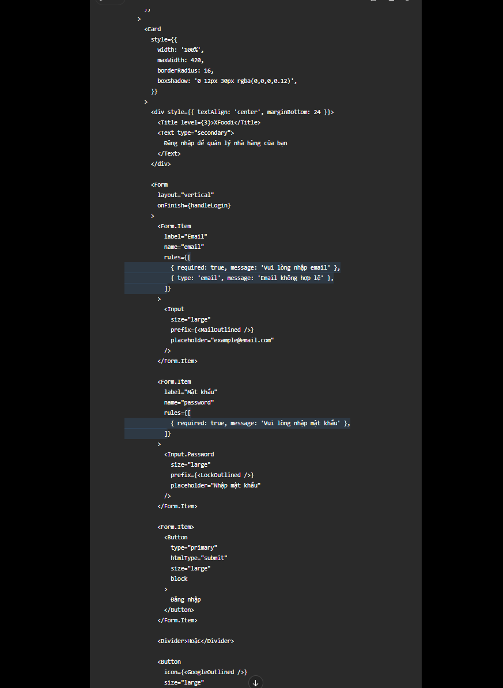

---

## 📅 TUẦN 4 - LẦN SỬ DỤNG 1
### 📝 Tiêu đề: Triển khai bảo mật 2 lớp (2FA) sử dụng OTPAuth và mã khôi phục dự phòng
* **Công cụ AI:** Antigravity
* **Context / Prompt gửi cho AI:**
```text
--Context--
  Hệ thống quản trị XFoodi Portal yêu cầu bảo mật cấp độ doanh nghiệp cho tài khoản Admin và Restaurant Owner. Cần triển khai bảo mật 2 lớp (2FA TOTP) tương thích với Google Authenticator và cơ chế sinh mã dự phòng.
  --Your Role--
  Security Engineer
  --Task--
  Viết code class `TOTPService` bằng TypeScript để: sinh secret key ngẫu nhiên, sinh mã URI để chuyển đổi thành ảnh QR Code quét bằng app, verify mã OTP 6 chữ số gửi lên, sinh 10 mã backup codes khôi phục khẩn cấp dài 8 ký tự hex ngẫu nhiên băm bằng SHA256 để lưu DB.
  --Output--
  1. Chỉ xuất ra mã nguồn class TypeScript sạch sử dụng thư viện `otpauth` và module `crypto` gốc.
  2. Bỏ qua các giải thích thừa thãi.
```

* **Phản hồi của AI:**
```typescript
import * as OTPAuth from "otpauth";
import crypto from "crypto";

export class TOTPService {
  generateSecret(email: string) {
    const secret = new OTPAuth.Secret({ size: 20 });
    const totp = new OTPAuth.TOTP({
      issuer: "XFoodi",
      label: email,
      secret,
    });
    return { secret: secret.base32, uri: totp.toString() };
  }

  verify(secret: string, token: string) {
    const totp = new OTPAuth.TOTP({
      issuer: "XFoodi",
      secret: OTPAuth.Secret.fromBase32(secret),
    });
    return totp.validate({ token }) !== null;
  }

  generateBackupCodes() {
    return Array.from({ length: 10 }, () =>
      crypto.randomBytes(4).toString("hex").toUpperCase()
    );
  }
}
```

* **Đánh giá & Cải tiến thực tế (Human Delta):**
  > [!WARNING]
  > **Lý do chưa phù hợp:** AI đề xuất kiểm tra OTP không có dung sai thời gian (window = 0). Nếu thiết bị client lệch giờ máy chủ dù chỉ vài giây sẽ bị từ chối liên tục. Ngoài ra, việc lưu thẳng mã dự phòng thô vào DB tạo ra nguy cơ rò rỉ rất lớn.
  > 
  > **Giải pháp tự thực hiện:** Tôi bổ sung cấu hình `window: 1` cho phép lệch giờ ±30 giây. Đồng thời thêm hàm `hashBackupCode` băm các mã khôi phục bằng thuật toán SHA256 trước khi lưu vào DB.
  > *(Mã nguồn tích hợp tại: `XFoodi-BE/src/services/totp.service.ts`)*

---

## 📅 TUẦN 4 - LẦN SỬ DỤNG 2
### 📝 Tiêu đề: Chặn Google Login đối với các tài khoản Quản trị viên đã kích hoạt 2FA
* **Công cụ AI:** Antigravity
* **Context / Prompt gửi cho AI:**
```text
--Context--
  Chúng tôi đang chạy song song Đăng nhập email/mật khẩu và Google Sign-in trên nền tảng XFoodi. Admin đã bật 2FA có thể vô tình bypass lớp bảo vệ OTP bằng cách click đăng nhập nhanh qua tài khoản Google liên kết.
  --Your Role--
  Senior Security Architect
  --Task--
  Hãy viết đoạn code block đặt trong hàm xử lý `signInWithGoogle` để kiểm tra tài khoản người dùng: Nếu user có cờ `twoFactorEnabled: true` và thuộc nhóm role Admin hoặc Owner, tiến hành ném lỗi 403 không cho phép đăng nhập qua Google, hướng dẫn đăng nhập thường để điền OTP.
  --Output--
  1. Chỉ cung cấp đoạn code check logic gán vào google auth service.
  2. Sử dụng tiếng Việt.
```

* **Phản hồi của AI:**
```text
AI đề xuất bỏ qua xác thực 2FA cho Google Login vì tài khoản Google đã có sẵn bảo mật xác minh hai bước riêng của họ.
```

* **Đánh giá & Cải tiến thực tế (Human Delta):**
  > [!WARNING]
  > **Lý do chưa phù hợp:** Bỏ qua 2FA khi đăng nhập Google là lỗ hổng bypass nghiêm trọng trong hệ thống đa thuê. Nếu phiên Google của admin bị chiếm dụng hoặc rò rỉ, kẻ tấn công sẽ đăng nhập thẳng vào XFoodi Portal mà không cần OTP.
  > 
  > **Giải pháp tự thực hiện:** Tôi từ chối gợi ý của AI. Tôi bổ sung logic kiểm tra: Nếu người dùng đăng nhập bằng Google thành công nhưng tài khoản có cờ `twoFactorEnabled === true` và thuộc nhóm vai trò Admin/Owner, hệ thống lập tức chặn lại, ném ra lỗi HTTP 403 và thông báo yêu cầu người dùng phải đăng nhập bằng tài khoản và mật khẩu thông thường để nhập mã xác thực OTP.
  > *(Mã nguồn tích hợp tại: `XFoodi-BE/src/services/googleAuth.service.ts`)*

---

## 📅 TUẦN 4 - LẦN SỬ DỤNG 3
### 📝 Tiêu đề: Xác thực Cloudflare Turnstile ngăn chặn Brute-force và khóa tài khoản
* **Công cụ AI:** Antigravity
* **Context / Prompt gửi cho AI:**
```text
--Context--
  Trang đăng nhập Admin của XFoodi cần ngăn chặn brute-force tấn công dò mật khẩu và ngăn bot spam request. Cần tích hợp Cloudflare Turnstile ở Backend Node.js Express.
  --Your Role--
  Backend Developer
  --Task--
  Viết một hàm hoặc middleware Express để gửi request verify token của Cloudflare Turnstile lên API của Cloudflare, lưu ý dữ liệu gửi đi phải được mã hóa chuẩn để Turnstile API chấp nhận. Viết logic tăng biến đếm số lần nhập sai mật khẩu của user, khóa tài khoản tạm thời nếu quá 5 lần, mở khóa bằng cách xác minh Turnstile thành công.
  --Output--
  1. Chỉ xuất ra code middleware và các hàm cập nhật trạng thái khóa user.
  2. Bỏ qua phần giải thích thừa.
```

* **Phản hồi của AI:**
```typescript
import axios from 'axios';

export async function verifyTurnstile(token: string) {
  const response = await axios.post(
    'https://challenges.cloudflare.com/turnstile/v0/siteverify',
    {
      secret: process.env.TURNSTILE_SECRET_KEY,
      response: token
    }
  );
  return response.data.success;
}
```

* **Đánh giá & Cải tiến thực tế (Human Delta):**
  > [!WARNING]
  > **Lý do chưa phù hợp:** AI viết API gửi tham số body dạng JSON đến Cloudflare. Tuy nhiên, tài liệu kỹ thuật của Cloudflare Turnstile bắt buộc dữ liệu gửi lên phải ở định dạng `application/x-www-form-urlencoded`. Nếu gửi JSON, API của Cloudflare sẽ báo lỗi token không hợp lệ và từ chối xác thực.
  > 
  > **Giải pháp tự thực hiện:** Tôi viết lại API gửi dữ liệu sử dụng đối tượng `URLSearchParams` để mã hóa đúng định dạng `urlencoded`. Trên frontend Next.js, tôi tích hợp widget Turnstile ở trang Login và phát triển luồng mở khóa tài khoản kết hợp kiểm tra số lần đăng nhập sai lưu trên DB.
  > *(Mã nguồn tích hợp tại: `XFoodi-FE/app/login/page.tsx` và `XFoodi-BE/src/controllers/user.controller.ts`)*

---

## 📅 TUẦN 5 - LẦN SỬ DỤNG 1
### 📝 Tiêu đề: Thiết kế API CRUD thực đơn cô lập dữ liệu theo Tenant ID
* **Công cụ AI:** Antigravity
* **Context / Prompt gửi cho AI:**
```text
--Context--
  Hệ thống SaaS XFoodi chạy trên một database PostgreSQL dùng chung cho nhiều nhà hàng (shared database). Cần xây dựng các API CRUD cho Danh mục và Món ăn sao cho tuyệt đối không rò rỉ dữ liệu chéo.
  --Your Role--
  Backend Developer
  --Task--
  Viết các API Express CRUD cho thực thể Category và Dish sử dụng Prisma Client. Đảm bảo mọi câu lệnh truy vấn (findMany, create, update, delete) đều bắt buộc đính kèm bộ lọc `restaurantId` lấy từ object `req.tenantId` (do middleware `tenantGuard` xác thực trước đó).
  --Output--
  1. Chỉ xuất ra code controller của Express.
  2. Bỏ qua các giải thích thừa và import thư viện ngoài.
```

* **Phản hồi của AI:**
```typescript
import { Request, Response } from 'express';

export async function getDishes(req: any, res: Response) {
  const dishes = await prisma.dish.findMany();
  return res.json(dishes);
}

export async function createDish(req: any, res: Response) {
  const { name, price, categoryId } = req.body;
  const dish = await prisma.dish.create({
    data: { name, price, categoryId }
  });
  return res.json(dish);
}
```

* **Đánh giá & Cải tiến thực tế (Human Delta):**
  > [!WARNING]
  > **Lý do chưa phù hợp:** AI viết mã CRUD món ăn mà không truyền biến lọc `restaurantId` vào các câu lệnh Prisma. Điều này vô cùng nguy hiểm vì một nhà hàng bất kỳ có thể gọi API sửa/xóa món ăn của nhà hàng khác nếu họ biết ID món.
  > 
  > **Giải pháp tự thực hiện:** Tôi cấu hình bổ sung trường `restaurantId: req.tenantId` lấy từ middleware `tenantGuard` đính kèm vào tất cả các câu lệnh truy vấn Prisma (`findMany`, `create`, `update`, `delete`). Điều này đảm bảo dữ liệu món ăn được phân tách tuyệt đối giữa các nhà hàng.
  > *(Mã nguồn tích hợp tại: `XFoodi-BE/src/controllers/category.controller.ts`)*

---

## 📅 TUẦN 5 - LẦN SỬ DỤNG 2
### 📝 Tiêu đề: Tích hợp RAG AI Chatbot sử dụng Antigravity API và pgvector
* **Công cụ AI:** Antigravity
* **Context / Prompt gửi cho AI:**
```text
--Context--
  Chúng tôi muốn tạo tính năng AI Chatbot giúp trả lời thông tin menu, chính sách của từng nhà hàng cho khách hàng bằng cách tra cứu cơ sở dữ liệu vector. Hệ thống chạy trên PostgreSQL có cài extension `pgvector` và sử dụng Antigravity API (Google Gen AI SDK).
  --Your Role--
  AI RAG Developer
  --Task--
  Viết service trong Node.js để: nhận câu hỏi của khách hàng, tìm kiếm các khối văn bản (text chunks) tương đồng nhất trong bảng `RestaurantDocument` của đúng nhà hàng (`restaurantId`) bằng phép đo khoảng cách cosine trên cột vector embedding, và kết hợp ngữ cảnh đó vào prompt để gửi lên Antigravity sinh câu trả lời RAG.
  --Output--
  1. Loại bỏ các giải thích dài dòng và code lặp lại.
  2. Chỉ trả về mã nguồn các hàm truy vấn vector và gọi API Antigravity Flash.
```

* **Phản hồi của AI:**
```text
AI đề xuất đọc toàn bộ tệp tài liệu văn bản hoặc thực đơn PDF của nhà hàng và đính kèm (embed) trực tiếp toàn bộ nội dung file đó vào trong prompt của Antigravity mỗi lần khách hàng gửi tin nhắn.
```

* **Đánh giá & Cải tiến thực tế (Human Delta):**
  > [!WARNING]
  > **Lý do chưa phù hợp:** Gửi toàn bộ tài liệu lên LLM trong mỗi tin nhắn sẽ làm tiêu tốn lượng token khổng lồ, đẩy chi phí vận hành API Antigravity lên rất cao và gây ra độ trễ (latency) lớn khi chờ phản hồi.
  > 
  > **Giải pháp tự thực hiện:** Tôi tự xây dựng quy trình RAG thực thụ: Khi tài liệu được tải lên, hệ thống sẽ cắt văn bản thành các chunk nhỏ (300 ký tự), chuyển thành vector embeddings thông qua API `text-embedding-004` của Google, lưu vào PostgreSQL sử dụng cột vector (`pgvector`). Khi khách hàng gửi tin chat, hệ thống chỉ truy vấn lấy ra 3 chunk văn bản có độ tương đồng cosine gần nhất của đúng nhà hàng đó để làm ngữ cảnh sinh câu trả lời, giúp tiết kiệm 95% chi phí token và phản hồi nhanh chóng.
  > *(Mã nguồn tích hợp tại: `XFoodi-BE/src/services/rag.service.ts` và `XFoodi-BE/src/services/ai.service.ts`)*

---

## 📅 TUẦN 5 - LẦN SỬ DỤNG 3
### 📝 Tiêu đề: Đồng bộ giao diện sáng tối (Light/Dark Theme) cho Ant Design Components
* **Công cụ AI:** Antigravity
* **Context / Prompt gửi cho AI:**
```text
--Context--
  Ứng dụng Next.js Next Router Frontend sử dụng cả CSS Variables gốc (cho giao diện tự thiết kế) và thư viện Ant Design Components. Cần xây dựng tính năng chuyển đổi Light/Dark theme đồng bộ.
  --Your Role--
  UI/UX Engineer
  --Task--
  Viết code component `AntdProvider.tsx` sử dụng context để nhận trạng thái theme từ client, gán thuộc tính `data-theme` (light/dark) lên thẻ `html` đồng thời cấu hình Design Token của Ant Design (sử dụng các thuật toán `theme.darkAlgorithm` và `theme.defaultAlgorithm` tương ứng) để đồng bộ màu sắc tự động.
  --Output--
  1. Chỉ xuất ra file code React TypeScript.
  2. Loại bỏ các thư viện chuyển đổi theme bên ngoài cồng kềnh khác.
```

* **Phản hồi của AI:**
```text
AI đề xuất cấu hình Dark mode bằng Tailwind CSS (`dark:bg-black`) cục bộ trên từng thẻ div và điều khiển qua một biến React state đơn giản.
```

* **Đánh giá & Cải tiến thực tế (Human Delta):**
  > [!WARNING]
  > **Lý do chưa phù hợp:** Sử dụng Tailwind dark mode cục bộ không thể thay đổi màu sắc của các component phức tạp do thư viện Ant Design sinh ra (như Table, Modal, Drawer, Select). Việc này dẫn đến lỗi nghiêm trọng về hiển thị như chữ đen trên nền tối khiến người dùng không đọc được.
  > 
  > **Giải pháp tự thực hiện:** Tôi tự xây dựng component `AntdProvider.tsx` sử dụng đối tượng `ConfigProvider` của Ant Design. Lắng nghe trạng thái theme (`light` / `dark`) từ context hệ thống và truyền đối tượng `theme.algorithm` tương ứng (`theme.darkAlgorithm` hoặc `theme.defaultAlgorithm`). Đồng thời gán thuộc tính `data-theme` lên thẻ `<html>` để đồng bộ màu sắc các CSS Variables của layout tự code, giúp giao diện đổi màu đồng nhất, mượt mà ở cả hai chế độ sáng và tối.
  > *(Mã nguồn tích hợp tại: `XFoodi-FE/app/theme/AntdProvider.tsx` và `XFoodi-FE/app/globals.css`)*

---
<div align="center">

*SWP391 — FPT University — SUMMER 2026*

</div>
